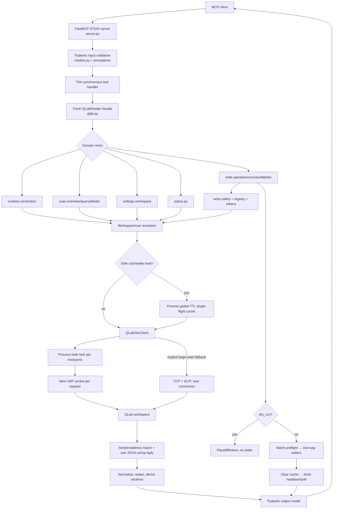

# 01 — Real Architecture

## Verdict

The read side is layered, bounded, and understandable. The write safety policy is strong, but the edit implementation is no longer an economical extension point: `write/operations.py` is 12,063 lines and its central `update_cues()` spans lines 695–2718 before another 9,000+ lines of family-specific helpers.

The current source exposes 13 MCP tools. The older graph in `docs/current/architecture/codebase_graphs.md` omits Move and Delete and is not authoritative.

## Runtime flow

Confirmed implementation details:

- `pyproject.toml:17` and `fastmcp.json:1-15` target the same server; `server.main()` only calls `mcp.run()` (`server.py:1122-1127`).
- Every handler constructs a fresh `QLabReader`, while the read cache is process-global (`server.py:219-227`, `qlab.py:41-52`, `runtime/read_cache.py:83-87`).
- UDP requests are serialized per endpoint tuple and use a new socket per request (`osc/client.py:86-138`). TCP fallback is explicit, not automatic for all requests.
- Reply handling rejects unrelated senders/addresses and requires one JSON string whose object has string `status` (`osc/client.py:225-313`).
- No receiver thread, subscription manager, persistent socket, background task, or application lifecycle cleanup hook exists. This keeps lifecycle simple but means updates/subscriptions are missing.
- No mutating transport retry exists. Some write paths retry fresh reads or structural convergence; a setter is not resent after timeout (`write/timeouts.py:9-84`).

## Important modules

### Public and shared boundary

| Module | Responsibility and public entries | Callers/dependencies/state/effects | Coverage, strengths, difficulties, simplification |
| --- | --- | --- | --- |
| `server.py` | FastMCP initialization, 13 public tools, client-visible descriptions, annotations, timeouts, schemas, `main()` | Called by FastMCP/console entry; depends on models, reader and response helpers; owns global `mcp`; invokes QLab reads/writes | Strong contract tests in `test_server_tools.py`. Thin handlers are good. At 1,127 lines, metadata is large but cohesive; do not split without edit-conflict evidence. |
| `models.py` | Pydantic input/output models | Used by server and MCP serialization; no effects | Explicit contracts are a strength. Some enums/ranges are not reflected in client schema; fix types before reorganizing the file. |
| `qlab.py` | Compatibility facade composed from connection, overview, settings, status, query, details, and write mixins | Server/tests call it; owns client and shared-cache reference; performs common request/workspace/cue primitives | Stable entry point. Multiple inheritance hides dependencies but replacing the facade would add churn; keep it and stop adding domain logic here. |
| `config.py` | Frozen environment configuration via `QLabConfig.from_env()` | Re-read for each fresh client; environment effects only | Minimal and clear. No new configuration layer needed. |
| `errors.py`, `server_responses.py`, `sanitizer.py` | Stable error translation, response normalization, redaction | Used across layers; no persistent state | Clear trust boundary; leave alone. |

### OSC and runtime

| Module | Responsibility and public entries | Callers/dependencies/state/effects | Coverage, strengths, difficulties, simplification |
| --- | --- | --- | --- |
| `osc/addressing.py` | Validate identifiers and build workspace/cue OSC paths | All domain modules; pure | Shared trust boundary, well focused. UUID recognition is shape-based; current tests cover it. |
| `osc/messages.py` | Standard-library OSC 1.0 encode/decode | OSC client; pure | Narrow, well tested by `test_osc.py`; leave alone. |
| `osc/client.py` | UDP/TCP transport, `/connect`, sender/address matching, JSON reply parsing | All readers/writers; class-level endpoint lock map and per-client connected-workspace set; sockets | Fail-closed matching and context-managed sockets are strengths. Coarse request serialization and an unbounded lock registry are weaknesses. Do not add a transport framework; first measure/fix the current lock behavior. |
| `runtime/read_cache.py` | Short TTL cache plus identical-call single-flight | Reader and write invalidation; global entry/in-flight dictionaries | Simple and effective for identical reads. Expired entries are removed only when that key is requested; unique query shapes can retain stale keys indefinitely. Add opportunistic expiry pruning and one retention test. |
| `runtime/connection.py` | `/workspaces`, `/connect`, `/showMode`, overrides, readiness diagnostics | Connection tool and write safety; several OSC probes | Rich operational result. Duplicates workspace resolution found in `qlab.py` and `status.py`; reuse the strict resolver. |

### Read domains

| Module(s) | Responsibility and public entries | Callers/dependencies/state/effects | Coverage, strengths, difficulties, simplification |
| --- | --- | --- | --- |
| `cues/refs.py`, `cues/index.py`, `cues/editorial.py` | Bounded traversal, index rows, editorial diagnostics | Overview/query/status; OSC reads through reader | One shared traversal is a strength. Keep as small helpers. |
| `cues/overview.py` | Bounded tree, optional full compact index, counts, selected/running samples | Overview tool; refs/profiles/connection; OSC reads | Cohesive despite 788 lines. Complete index can coexist with a partial tree, which the result reports explicitly. |
| `cues/query.py` | Filter normalization and bounded cue scan | Query tool; refs/profiles/cache; sequential OSC reads | Good completeness/truncation metadata. Potentially round-trip heavy; optimize only after call-count measurement. |
| `cues/details.py`, `cues/profiles.py` | Profile-based cue reads, type-aware sections, editable metadata | Detail tool and write verification; OSC/settings reads | Strong safe/technical profile separation. Read code imports write registry metadata for `editable`, coupling read and write surfaces. Keep the feature but move only when the write manifest becomes canonical. |
| `cues/coverage.py` | Parse local OSC Dictionary and report read coverage | Exhaustive detail/report tests; reads `docs/references/qlab_osc_dictionary.md` at runtime | Useful in a checkout, but the wheel does not include docs, so installed coverage legitimately becomes `unavailable`. Either package/version the reference or make this explicitly development-only. |
| `settings/workspace.py`, `settings/summarizers.py`, `settings/redaction.py`, `settings/light_commands.py` | Settings summary/details, item resolution, normalization, redaction, Light analysis | Settings/status/details; many OSC calls; TCP for large Light patch | Safe detail profiles are strong. `workspace.py` is 1,130 lines but still one domain; split only one coherent section if modification pressure warrants it. |
| `status.py` | Derived warnings, triggers, timecode and settings status; explicit `not_exposed` sections | Status tool; cue scan + settings reads | Honest about QLab gaps. Duplicates workspace resolution and performs broad sequential reads. |
| `allowlist.py` | Read-only cue property allowlist and profile support | Read path; pure data/validation | Strong trust boundary; leave alone. |

### Write domains

| Module(s) | Responsibility and public entries | Callers/dependencies/state/effects | Coverage, strengths, difficulties, simplification |
| --- | --- | --- | --- |
| `write/registry.py`, `write/allowlist.py` | Property specs, validators, risk, readback, gates, profiles | Editable discovery and edit planner; static data | Mature data-driven policy source with registry coverage tests. Large but coherent; do not replace with dynamic registration. |
| `write/safety.py` | Disabled-by-default readiness, passcode, edit scope and Edit Mode | All real writes; readiness lock and OSC probes | Clear fail-closed boundary with extensive tests. Leave alone. |
| `write/operations.py` | Create/edit planning, 20+ specialized families, tokens, execution, verification, recovery | QLabReader facade; OSC setters/readback; process-bound secrets and recovery dictionaries | Main bottleneck: 12,063 lines, 409 functions; `update_cues()` routes all families. Extract one already-coherent family at a time behind the same orchestrator; no plugin/factory framework. |
| `write/moves.py`, `write/deletes.py` | Structural plan binding, dedicated tokens, sequential execution, convergence/existence verification | Public Move/Delete tools; mutating OSC | Better boundaries than edit families. Explicitly non-atomic and well tested. Use these as the extraction shape, not as a reason to generalize all writes. |
| `write/groups.py` | Group mode/playlist validation and consumed-token ledger | Edit orchestrator; process-bound token state | Strong snapshot binding and pruning. Avoid merging token codecs until a small shared codec proves identical semantics. |
| `write/timeouts.py`, `write/results.py` | Read budgets and aggregate result construction | Edit operations; pure | Successful small extractions; leave focused. |
| `write/osc_inventory.py` | Parse checked-in dictionary and compare registry coverage | Tests and read coverage reporting | Pure and useful. Its location under `write` is imperfect but moving it has little payoff. |

## State and lifecycle findings

- Read cache entries and transport locks have no global bound.
- Group consumed tokens are pruned. Fade recovery records and stage-ID recovery baselines have workflow-specific removal only; audit their maximum lifetime and add bounded cleanup if they can survive abandoned workflows.
- Each tool gets a new client, so `_connected_workspaces` is short-lived and `/connect` may be repeated more often than necessary.
- The server has no logging framework beyond FastMCP/runtime errors. Diagnostic payloads are rich, but there is no structured transport-level event stream.

## Architecture priorities

1. P1: correct the observed concurrent-read collapse before adding subscriptions or persistent transport complexity.
2. P1: opportunistically prune expired cache entries and bound recovery registries.
3. P1: reuse one strict workspace resolver across core, connection and status.
4. P2: extract one specialized edit family at a time from `write/operations.py`, preserving public schemas and the batch orchestrator.
5. P4: update the checked-in architecture graph to the 13-tool surface.

Leave OSC encoding, write readiness, registry structure, result models, and the `QLabReader` facade alone unless a concrete failure requires change.
