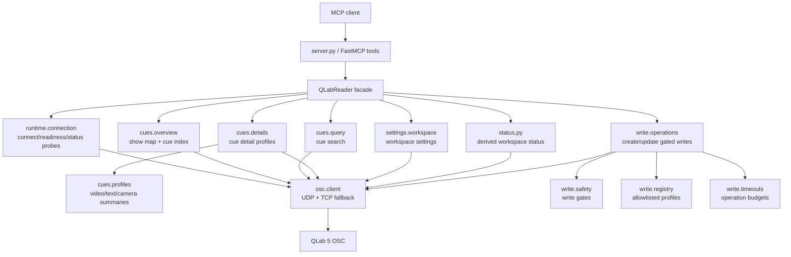
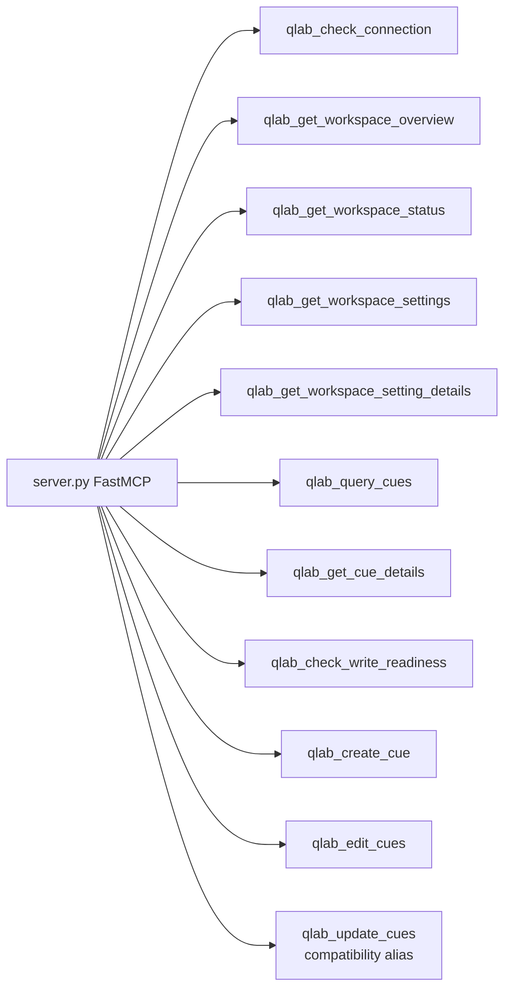
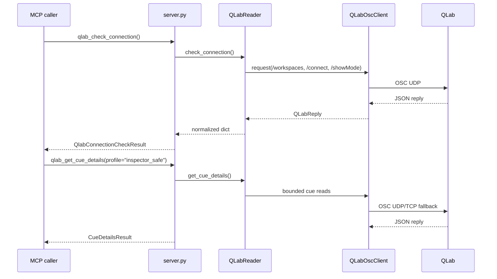
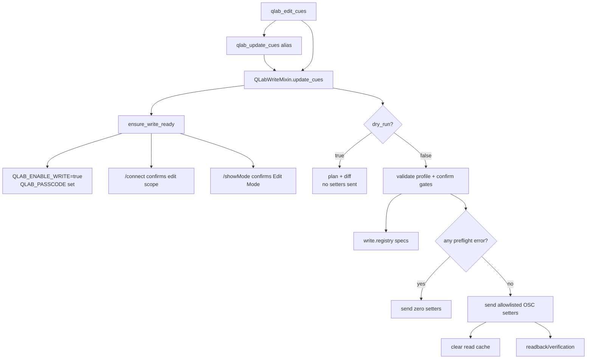
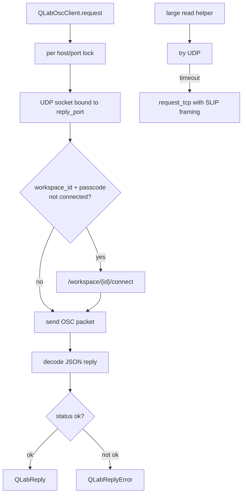
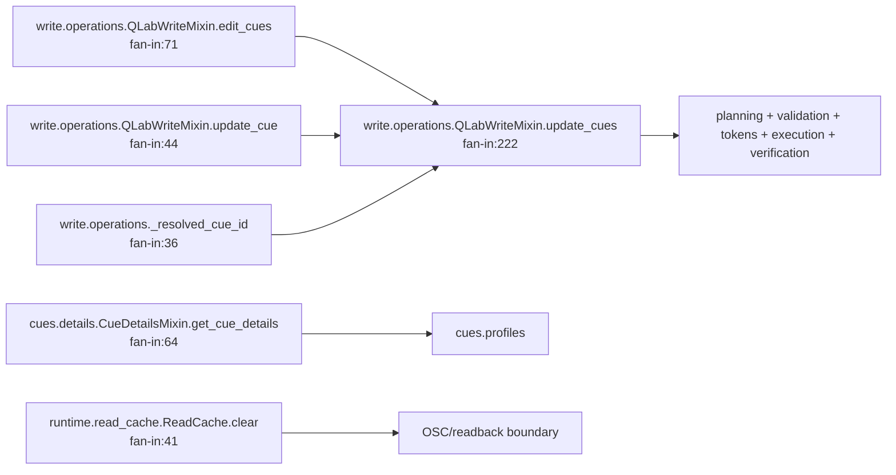

# Codebase Graphs

Proyecto Codebase MCP: `Users-filarmonica-Documents-qlab-mcp-osc`.

Snapshot regenerado con `codebase-memory-mcp` el 2026-07-09.

- 2363 nodos, 14148 relaciones.
- Nodos principales: 1037 funciones, 403 secciones, 338 variables, 285 metodos, 106 modulos, 105 archivos, 52 clases.
- Relaciones principales: 3582 `SEMANTICALLY_RELATED`, 3568 `CALLS`, 2221 `DEFINES`, 1762 `USAGE`, 1248 `TESTS`, 691 `WRITES`.
- Lenguajes indexados: Python 44 archivos, TOML 1 archivo.
- Entry point: `qlab-mcp = qlab_mcp.server:main`.
- Runtime FastMCP: `src/qlab_mcp/server.py:mcp`.
- Persistencia del indice local: el MCP respondio `artifact_present:false`; no se encontro `.codebase-memory/graph.db.zst` dentro del repo.

## Arquitectura



## Herramientas MCP Expuestas



## Flujo Read-Only Recomendado



## Flujo Write Gated



## OSC Core



## Codebase MCP Hotspots



## Video/Text/Camera Write Surface

- `video_basic`: common cue fields plus video visual, geometry, IO, embedded audio, slice marker and video FX paths. Most real writes are specialized and confirm-token gated.
- `camera_basic`: common fields plus mic/video/catalog camera paths. Shares much of video visual geometry machinery.
- `text_basic`: common fields, text content basics, selected visual properties, and rich text/style paths. Phase 3F real writes remain blocked where fresh readback is unreliable.
- Public preferred tool name is `qlab_edit_cues`; `qlab_update_cues` remains a compatibility alias.

## Cambio Seguro: Donde Tocar

- Nueva tool MCP: empezar en `src/qlab_mcp/server.py`, delegar a `QLabReader`, no cambiar firmas publicas sin decision explicita.
- Nueva lectura de cues: mirar `src/qlab_mcp/cues/*`; usar `_request_data` y perfiles de `cues.profiles`.
- Nueva lectura de settings: mirar `src/qlab_mcp/settings/workspace.py`.
- Nuevo write profile: mirar primero `src/qlab_mcp/write/registry.py`; luego el minimo helper en `src/qlab_mcp/write/operations.py`.
- Refactor de write: extraer una responsabilidad cada vez desde `src/qlab_mcp/write/operations.py`; no dividir todas las familias en una sola PR.
- Cambios OSC bajo nivel: tocar `src/qlab_mcp/osc/client.py` solo si el problema es transporte, timeout, parseo o passcode.

## Checks Minimos

```bash
uv run pytest tests/test_server_tools.py
uv run pytest tests/test_write_mode.py tests/test_update_registry_coverage.py
uv run pytest tests/test_qlab_reader.py
```
