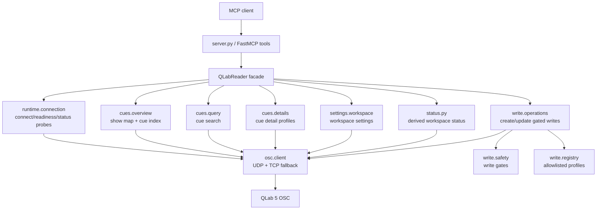
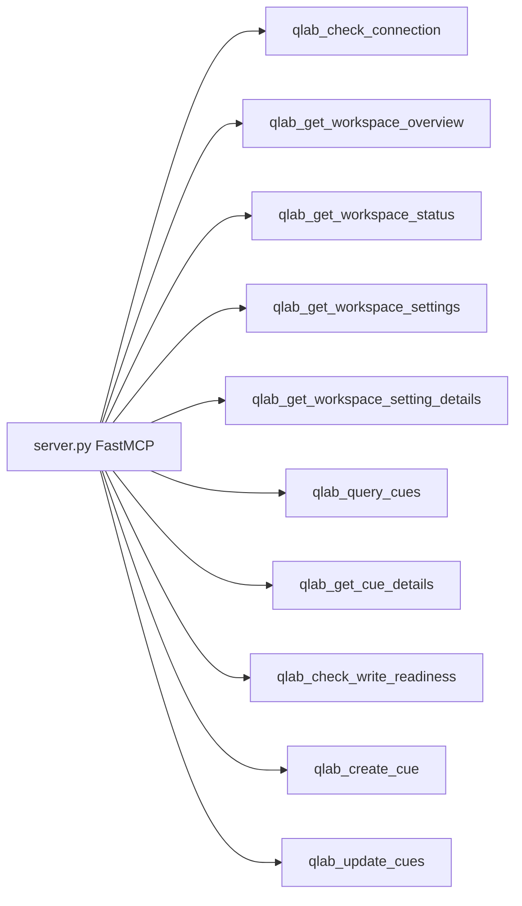
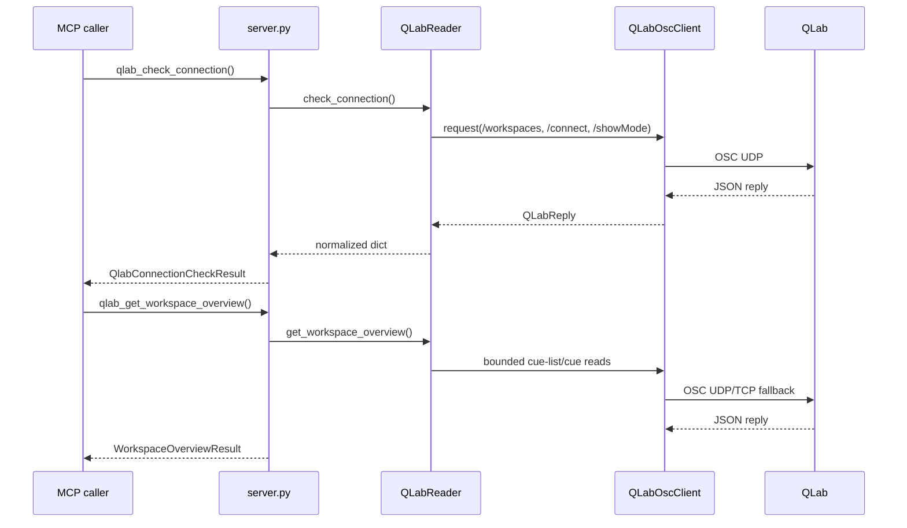
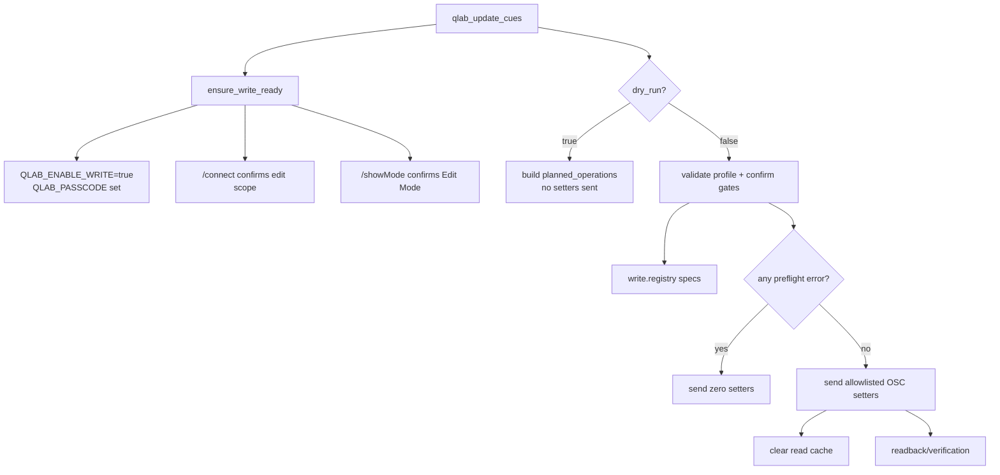
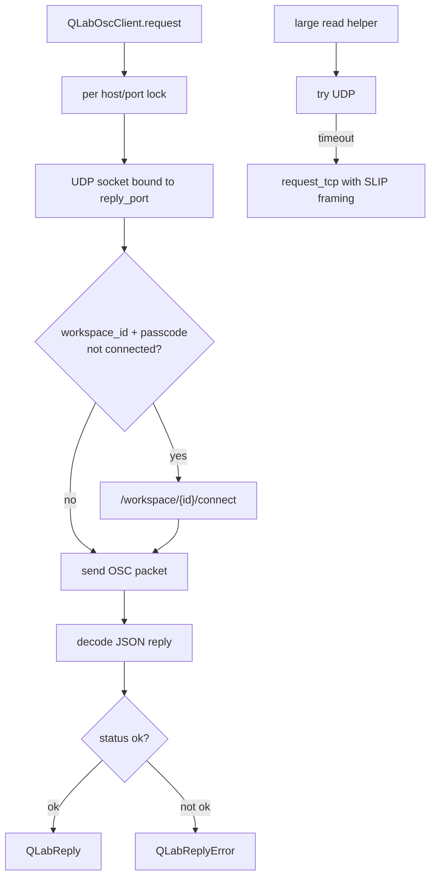
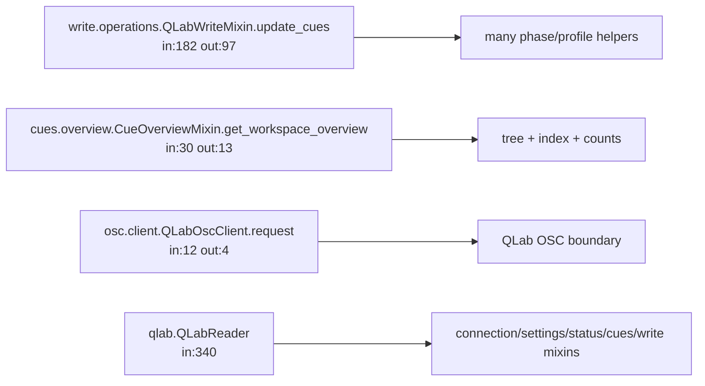

# Codebase Graphs

Proyecto Codebase MCP: `Users-filarmonica-Documents-qlab-mcp-osc`.

Snapshot:

- 1787 nodos, 10305 relaciones.
- Nodos principales: 756 funciones, 271 metodos, 73 modulos, 52 clases.
- Relaciones principales: 2645 `CALLS`, 1407 `USAGE`, 1004 `TESTS`, 541 `WRITES`, 222 `IMPORTS`.
- Entry point: `qlab-mcp = qlab_mcp.server:main`.
- Runtime FastMCP: `src/qlab_mcp/server.py:mcp`.

## Arquitectura



## Herramientas MCP Expuestas



## Flujo Read-Only Recomendado



## Flujo Write Gated



## OSC Core



## Codebase MCP Hotspots



## Cambio Seguro: Donde Tocar

- Nueva tool MCP: empezar en `src/qlab_mcp/server.py`, delegar a `QLabReader`.
- Nueva lectura de cues: mirar `src/qlab_mcp/cues/*`; usar `_request_data` para cache seguro.
- Nueva lectura de settings: mirar `src/qlab_mcp/settings/workspace.py`.
- Nuevo write profile: mirar primero `src/qlab_mcp/write/registry.py`; luego el minimo helper en `src/qlab_mcp/write/operations.py`.
- Cambios OSC bajo nivel: tocar `src/qlab_mcp/osc/client.py` solo si el problema es transporte, timeout, parseo o passcode.

## Checks Minimos

```bash
uv run pytest tests/test_server_tools.py
uv run pytest tests/test_write_mode.py
uv run pytest tests/test_qlab_reader.py
```
